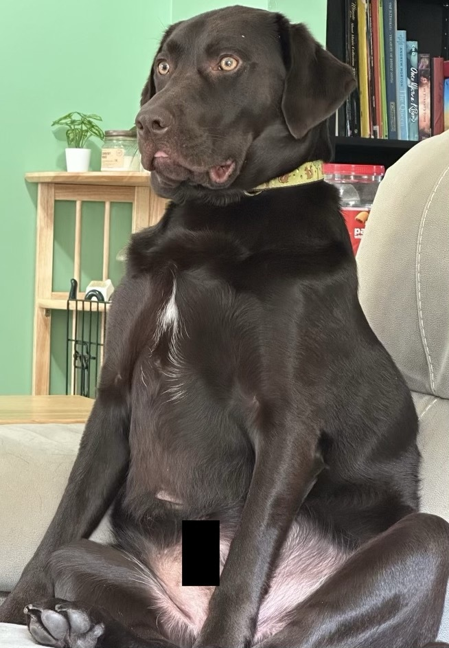

# Hello Everyone!

## My name is Heather Kirkness
My pronouns are she/her

## I am currently attending Arizona State University and am in their User Experience Program
I very much enjoy front end development and hope to have a career in it one day!

## I love my dog more than life itself

He is a major dope

<!--
**hlkirkness/hlkirkness** is a ✨ _special_ ✨ repository because its `README.md` (this file) appears on your GitHub profile.

Here are some ideas to get you started:

- 🔭 I’m currently working on ...
- 🌱 I’m currently learning ...
- 👯 I’m looking to collaborate on ...
- 🤔 I’m looking for help with ...
- 💬 Ask me about ...
- 📫 How to reach me: ...
- 😄 Pronouns: ...
- ⚡ Fun fact: ...
-->
